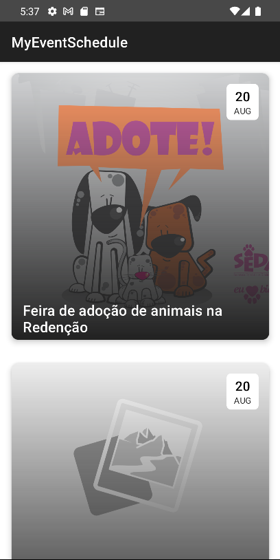

<h1 align="center">My Event Schedule</h1>
<p align="center">Aplicativo portifólio com a finalidade de listar eventos de acordo com retorno de uma API<br></p>


## Conhecendo o App

<div>
    
    
    
</div>

- [x] Listagem de eventos utilizando flow e coroutines
- [x] Exibição de detalhes dos eventos
- [x] É permitido fazer check-in no app
- [x] Funcionalidade de enviar o usuário para intent do google maps


### 🛠 Libs

```kotlin
    /** LIFECYCLE COMPONENTS */
	implementation "androidx.lifecycle:lifecycle-extensions:2.2.0"
	implementation "androidx.lifecycle:lifecycle-viewmodel-ktx:2.4.0"
	implementation "androidx.lifecycle:lifecycle-runtime-ktx:2.4.0"


	/** RETROFIT */
	implementation "com.squareup.retrofit2:retrofit:$retrofitVersion"
	implementation "com.squareup.retrofit2:converter-gson:$retrofitVersion"
	implementation "com.squareup.retrofit2:adapter-rxjava2:$retrofitVersion"

	/** COROUTINES */
	implementation "org.jetbrains.kotlinx:kotlinx-coroutines-core:$coroutinesVersion"
	implementation "org.jetbrains.kotlinx:kotlinx-coroutines-android:$coroutinesVersion"

	/** PICASSO */
	implementation 'com.squareup.picasso:picasso:2.71828'
```

<h3>Criado por Ricardo Souza ♥</h3>